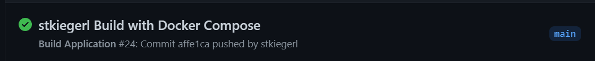
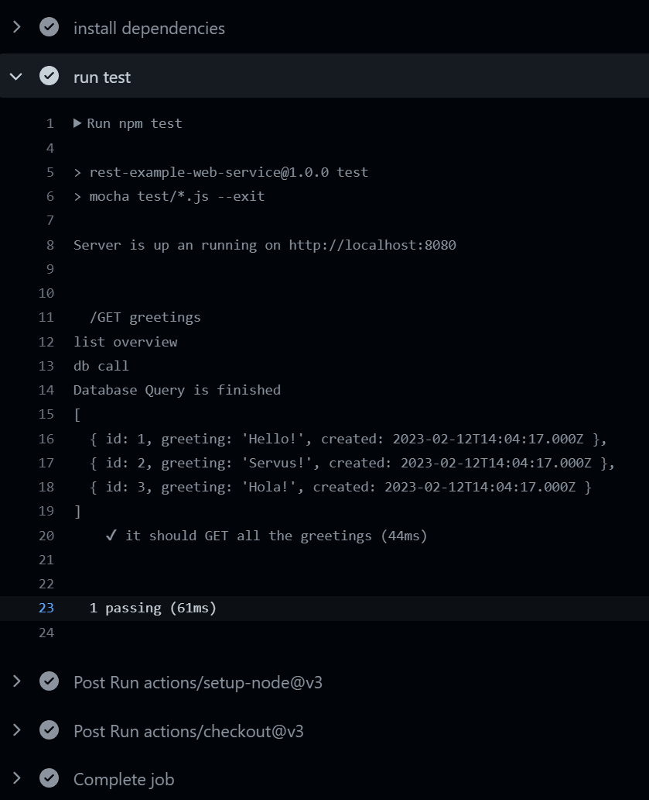

# Part 1 - Docker Compose
## Getting Started
Follow the instructions from https://docs.docker.com/compose/gettingstarted/

### Docker Compose commands:
Download and build the Images
```shell
docker compose build
```

Create and start the containers:
```shell
docker compose up
```

Remove a container
```shell
docker compose rm
```

Get help for docker commands
```shell
docker compose help
```

Use a yaml file with another name as docker compose file
```shell
docker compose -f <docker-compose-filename> up
```

### Results


# Part 2 - Clone and get to know the repository
## Running the application with docker compose
When running "docker compose up", http://localhost:8080/ responds as expected\


Also http://localhost:8080/greetings responds as expected\


The first time http://localhost:8080/greetings is called, you can see in the console that the data is queried from the 
database\


The second time http://localhost:8080/greetings is called, you can see in the console that the data is gathered from the
Redis cache.


## Installing dependencies
Switch to the "app" directory and run this command to install all dependencies
```shell
npm install
```

## Running Tests
1. Stop the running instance of docker compose

2. To be able to run tests you need an instance of the Database and the Redis cache, but a free port 8080, so i created a new 
docker-compose.test-env.yml file:
```yaml
version: '3.8'

services:
  database-server:
    # using .env file to configure e.g. version number or other currently static variables
    image: mysql:8.0
    container_name: contdel-db-server
    restart: always
    # setting environment variables
    environment:
      MYSQL_DATABASE: 'contdel'
      # So you don't have to use root, but you can if you like
      MYSQL_USER: 'fhj'
      # You can use whatever password you like
      MYSQL_PASSWORD: 'password'
      # Password for root access
      MYSQL_ROOT_PASSWORD: 'password'
    ports:
      - '3306:3306'
    # Where our data will be persisted
    volumes:
      - ./mysql-data:/var/lib/mysql
      - ./mysql-init-files:/docker-entrypoint-initdb.d
    # check for status for depends_on conditions for api container start = service_healthy
    # otherwise no connection is possible at startup, alternative will be to refactor node implementation
    healthcheck:
      test: ["CMD", "mysqladmin" ,"ping", "-h", "localhost"]
      timeout: 20s
      retries: 10
      start_period: 20s # Estimated time to boot.

  # using redis for caching server, therefor we will use existing image
  # currently we not need any special configuration, so the docker-compose configuration is simple
  cache-server:
    image: redis
    container_name: contdel-cache-server
    ports:
      - '6379:6379'
    restart: always

  # at last we build our own image by using Dockerfile in Sub-Directory
  api:
    container_name: contdel-api-server
    build: ./app
    # container will be started after dependencies are fulfilled
    depends_on:
      cache-server:
        condition: service_started
      database-server:
        condition: service_healthy
    ports:
      - "8181:8181"
    environment:
      SERVER_PORT: 8181
      DB_SERVER: database-server
      CACHE_SERVER: cache-server
```

3. Start docker compose with the new yaml file
```shell
docker compose -f docker-compose.test-env.yml up
```

4. Then run the tests locally
```shell
npm test
```

### Result


# Part 3 - Extend GitHub Workflow
1. To run the test with GitHub Actions you need an instance of the Database and the Redis cache and a free port 8080. For that create a
   new docker-compose.container-env.yml file:
```yaml
version: '3.8'

services:
  database-server:
    # using .env file to configure e.g. version number or other currently static variables
    image: mysql:8.0
    container_name: contdel-db-server
    restart: always
    # setting environment variables
    environment:
      MYSQL_DATABASE: 'contdel'
      # So you don't have to use root, but you can if you like
      MYSQL_USER: 'fhj'
      # You can use whatever password you like
      MYSQL_PASSWORD: 'password'
      # Password for root access
      MYSQL_ROOT_PASSWORD: 'password'
    ports:
      - '3306:3306'
    # Where our data will be persisted
    volumes:
      - ./mysql-data:/var/lib/mysql
      - ./mysql-init-files:/docker-entrypoint-initdb.d
    # check for status for depends_on conditions for api container start = service_healthy
    # otherwise no connection is possible at startup, alternative will be to refactor node implementation
    healthcheck:
      test: ["CMD", "mysqladmin" ,"ping", "-h", "localhost"]
      timeout: 20s
      retries: 10
      start_period: 20s # Estimated time to boot.

  # using redis for caching server, therefor we will use existing image
  # currently we not need any special configuration, so the docker-compose configuration is simple
  cache-server:
    image: redis
    container_name: contdel-cache-server
    ports:
      - '6379:6379'
    restart: always

  # at last we build our own image by using Dockerfile in Sub-Directory
  api:
    container_name: contdel-api-server
    build: ./app
    # container will be started after dependencies are fulfilled
    depends_on:
      cache-server:
        condition: service_started
      database-server:
        condition: service_healthy
    ports:
      - "8181:8181"
    environment:
      SERVER_PORT: 8181
      DB_SERVER: database-server
      CACHE_SERVER: cache-server
```

2. Create a Workflow to test the application with GitHub Actions
```yaml
name: Build Application
run-name: ${{ github.actor }} Build with Docker Compose
on:
  push:
    paths-ignore:
      - '*.md'
jobs:
  build:
    runs-on: ubuntu-latest
    steps:
      # Checkout Repository
      - uses: actions/checkout@v3
      # Run Docker Compose up
      - name: docker compose
        env:
          MYSQL_VERSION: "8.0"
        run: docker compose -f docker-compose.container-env.yml up -d
      # setup node environment
      - uses: actions/setup-node@v3
        with:
          node-version: 18
      # install current dependencies in sub-directory
      - name: install dependencies
        working-directory: ./app
        run: npm install
      # run current tests in sub-directory
      - name: run test
        working-directory: ./app
        run: npm test
```

3. Create a .dockerignore file in the /app folder, so that the node_modules folder is not copied to the image
```
node_modules/
```

### Results



# Questions
### How can several containers be used together?
With Docker Compose you can define a multi container applications and start all containers with one command.

### What advantages does this modular separation offer?
-Each component can be scaled independently
-Each component runs in its own environment

### How is a docker-compose.yml structured?
```yaml
version: '3.8'                         # defines the version of docker compose
services:                            # each service defines a container inside the docker compose application
  service_name_1:                    # the first service can be  a container that builds with a dockerfile
    build: .
    ports:
      - "80:80"
    volumes:
      - .:/app
  database-server:                    # the second service could be a mysql server container
    image: mysql
    environment:
       MYSQL_PASSWORD: password
```

### Which points have to be considered when using Docker Compose and CI/CD pipelines?
The containers must be started in the correct order and the used ports of the containers should be free.