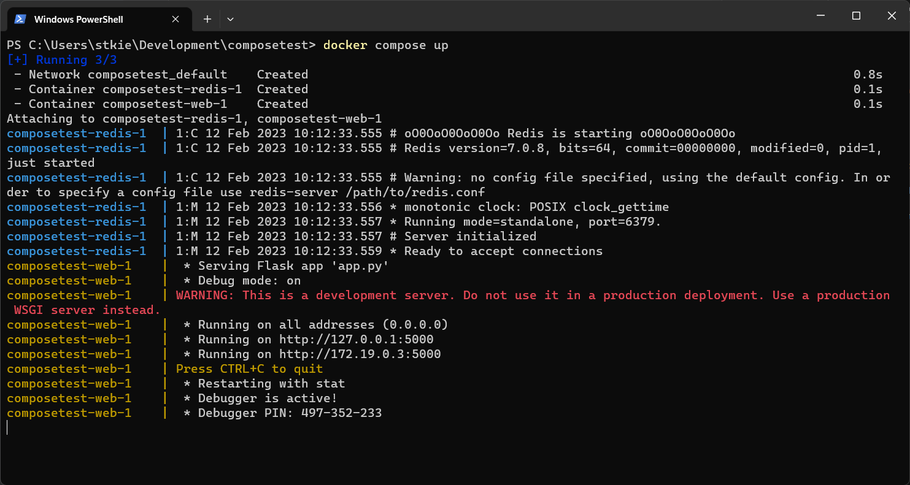
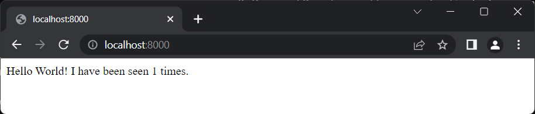
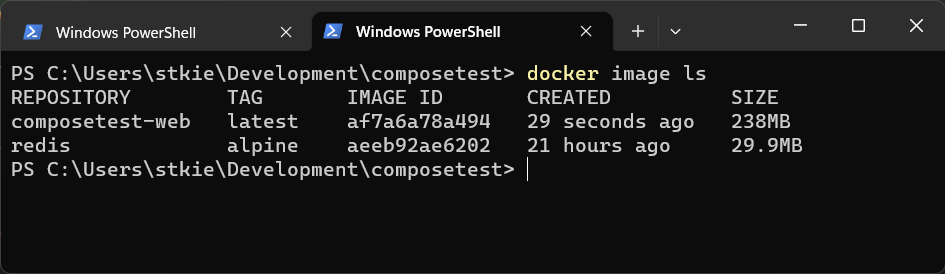
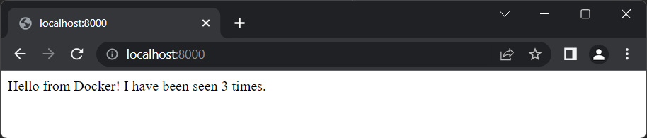
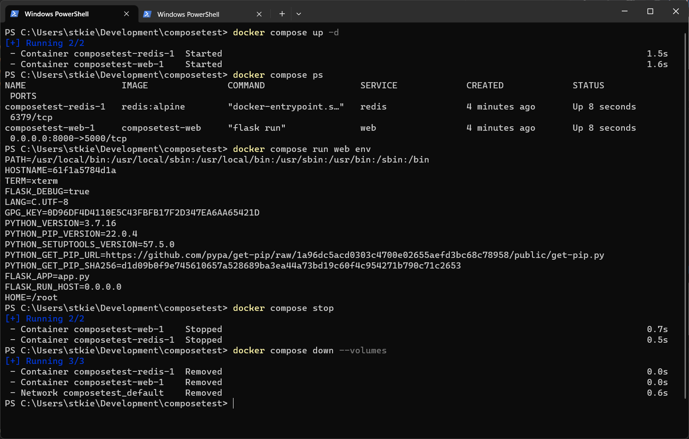
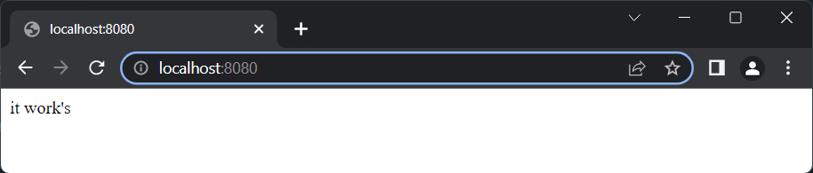
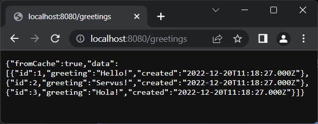
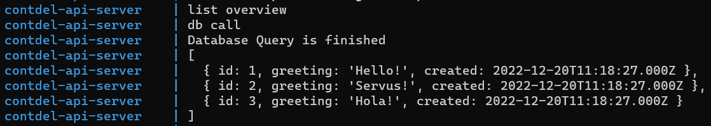
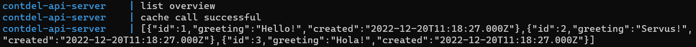
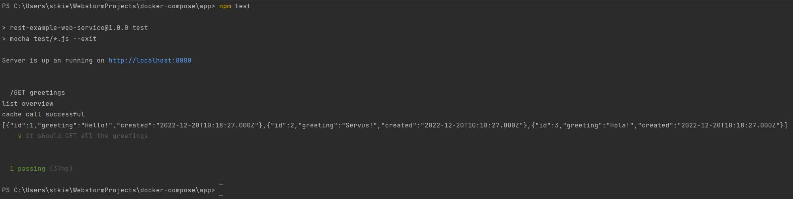

# Part 1 - Docker Compose
## Getting Started
Follow the instructions from https://docs.docker.com/compose/gettingstarted/

### Docker Compose commands:
Download and build the Images
```shell
docker compose build
```

Create and start the containers:
```shell
docker compose up
```

Remove a container
```shell
docker compose rm
```

Get help for docker commands
```shell
docker compose help
```

Use a yaml file with another name as docker compose file
```shell
docker compose -f <docker-compose-filename> up
```

### Result:








# Part 2 - Clone and get to know the repository
## Running the application with docker compose
When running "docker compose up", http://localhost:8080/ responds as expected\


Also http://localhost:8080/greetings responds as expected\


The first time http://localhost:8080/greetings is called, you can see in the console that the data is queried from the 
database\


The second time http://localhost:8080/greetings is called, you can see in the console that the data is gathered from the
Redis cache.


## Installing dependencies
Switch to the "app" directory and run this command to install all dependencies
```shell
npm install
```

## Running Tests
1. Stop the running instance of docker compose

2. To be able to run tests you need an instance of the Database and the Redis cache, so i created a new 
docker-compose.test.yml file:
```yaml
version: '3.8'

services:
  database-server:
    # using .env file to configure e.g. version number or other currently static variables
    image: mysql:${MYSQL_VERSION}
    container_name: contdel-db-server
    restart: always
    # setting environment variables is possible within docker-compose.yml
    environment:
      MYSQL_DATABASE: 'contdel'
      # So you don't have to use root, but you can if you like
      MYSQL_USER: 'fhj'
      # You can use whatever password you like
      MYSQL_PASSWORD: 'password'
      # Password for root access
      MYSQL_ROOT_PASSWORD: 'password'
    ports:
      - '3306:3306'
    # Where our data will be persisted
    volumes:      
      - ./mysql-data:/var/lib/mysql
      - ./mysql-init-files:/docker-entrypoint-initdb.d
    # check for status for depends_on conditions for api container start = service_healthy
    # otherwise no connection is possible at startup, alternative will be to refactor node implementation
    healthcheck:
        test: ["CMD", "mysqladmin" ,"ping", "-h", "localhost"]
        timeout: 20s
        retries: 10
        start_period: 20s # Estimated time to boot.

  # using redis for caching server, therefor we will use existing image
  # currently we not need any special configuration, so the docker-compose configuration is simple
  cache-server:
    image: redis
    container_name: contdel-cache-server
    ports:
      - '6379:6379'
    restart: always
```

Start docker compose with the new yaml file
```shell
docker compose -f docker-compose.test.yml up
```

Then run the tests locally
```shell
npm test
```

### Result


# Part 3 - Extend GitHub Workflow

# Questions
### How can several containers be used together?


### What advantages does this modular separation offer?


### How is a docker-compose.yml structured?


### Which points have to be considered when using Docker Compose and CI/CD pipelines?